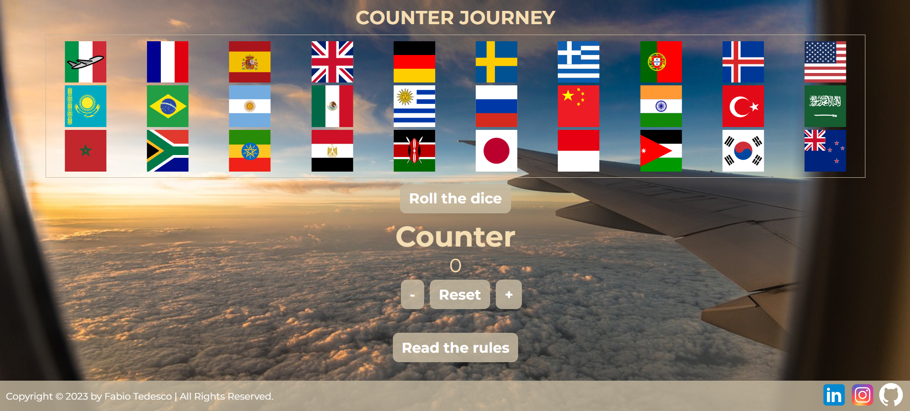

# COUNTER JOURNEY

   

This is the final project for [start2impact](https://www.start2impact.it/) course of "JavaScript Basics" in the Full-stack developer master.
  

<a href="https://counterjourney.netlify.app/">✈️ PLAY COUNTER JOURNEY</a>  
<a href="">📜 READ PRESENTATION </a>

## GAMEPLAY

1. **Roll the dice:**
   - Click the "Roll the dice" button and see what is the result.

2. **Move the airplane**
   - Go forward by clicking on the "+" button and the plane will move on the flags.

3. **You may have good luck or bad luck 🤞🏼**
   - When you stop on a flag there could be an unforeseen event, if it is a good one 🍀 you will be able to go forward a few extra moves. If it is a bad one 😞 you must go back. 

4. **Reach out the New Zealand flag:**
   - If you can get to the end you Win!

5. **Reset**
   - You can reset the game any time you want. The game will reset when you win anyway.

## THE IDEA 
"Counter Journey" is a simple game created using a combination of HTML, CSS, and JavaScript. The core of the experience is a virtual dice, activated by pressing a button, which determines the number of spaces the player advances. Each movement is associated with a "+" button, which must be pressed a number of times equal to the value of the dice.

The game transports the player through different squares, each represented by a flag of a country. An  airplane accompanies the player during the journey, moving from one flag to another with each press of the "+" button.

Surprises are an integral part of the adventure, with positive and negative unforeseen events that can influence the course of the journey. Some events lead to forward movements, while others may force the little airplane to take a step back.

## BUILT WITH

 **** 
 **** 
 **** 

## FILE STRUCTURE

- `index.html`: The main HTML file provides the gameboard.
- `styles.scss`: The SCSS file style the game.
- `script.js`: The JavaScript file contains the elements that add dynamism and interactivity to the game.

## Contacts

 
 

(<a href="#readme-top">back to top</a>)
